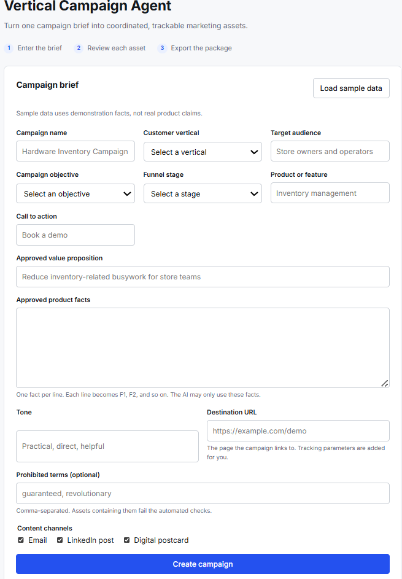
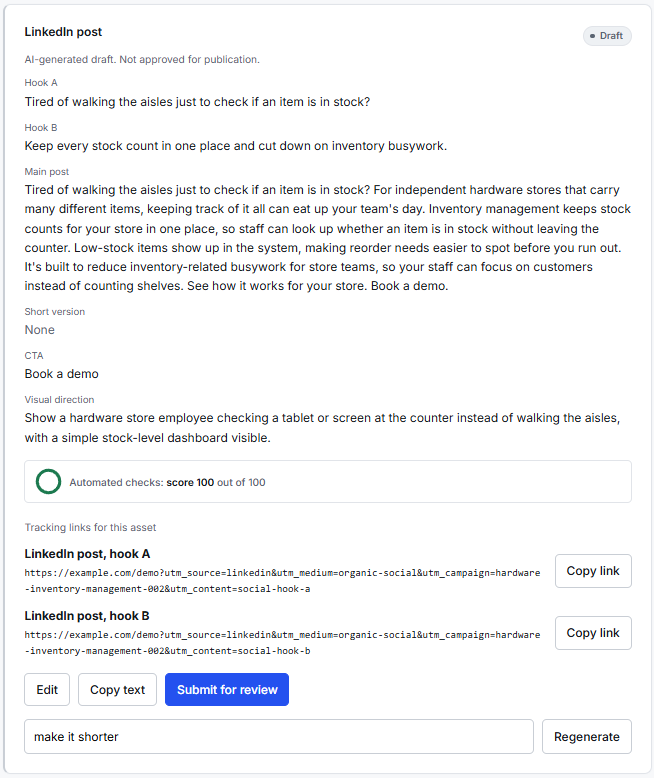
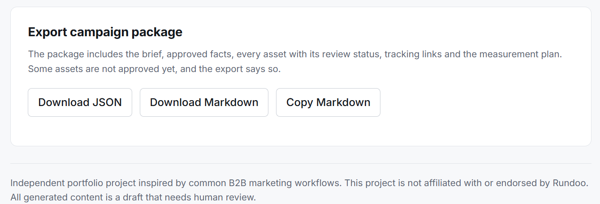
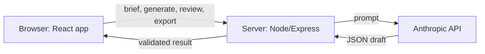

# Vertical Campaign Agent

## 1. Project summary

Vertical Campaign Agent is an AI-assisted workflow that turns a single campaign brief into a coordinated set of marketing assets - an email, a LinkedIn post, and a digital postcard - each with A/B variants, automated quality checks, a human review workflow, tracking links, and a measurement plan. It's a portfolio project inspired by common B2B marketing operations tooling.

> Independent portfolio project inspired by common B2B marketing workflows. This project is not affiliated with or endorsed by Rundoo.

## 2. Problem being solved

Coordinating a multi-channel campaign usually means writing each asset separately, with no shared source of truth for what claims are actually approved. That leads to three recurring problems: copy drifts from the approved facts (or invents numbers), assets across channels contradict each other on the core message, and there's no consistent way to track which variant of which asset drove a result. This tool addresses all three by generating every asset from the same numbered set of approved facts, running automated checks before anything can be approved, and building UTM-tagged tracking links automatically so results can be attributed back to a specific variant.

## 3. Live demo

**https://vertical-campaign-agent.onrender.com**

The free hosting tier sleeps after inactivity, so the first load after a pause can take about a minute.

## 4. Walkthrough

* Walkthrough Gif


* Brief form


* Asset review with automated checks


* Exporting generated results with options


## 5. Main features

- **Structured campaign brief** with field-level validation (audience, objective, funnel stage, approved facts, CTA, prohibited terms)
- **Grounded multi-channel generation**: email, LinkedIn post, and digital postcard, each with A/B variants, generated only from the brief's approved facts
- **Automated quality checks** that flag unsupported claims, a missing or altered CTA, prohibited terms, and channel-specific length limits, and block approval until they're resolved
- **Human review workflow** with four states (Draft, Needs review, Approved, Rejected), rejection reasons, and reviewer notes
- **Independent regeneration**: regenerating one asset, or regenerating with a specific instruction, never touches the others
- **Campaign ID and UTM tracking links**, generated automatically and consistently for every asset variant
- **Measurement plan**: primary and secondary KPIs and a conversion event, derived from the campaign's objective and funnel stage
- **JSON and Markdown export** of the full campaign package, including review status
- **Browser-persisted campaigns**: a page refresh doesn't lose your work
- **Clear failure states** for every AI or network error, with no request that can hang indefinitely

## 6. Technology stack

| Layer | Choice |
|---|---|
| Frontend | React, TypeScript, Vite |
| Backend | Node.js, Express |
| Validation | Zod (shared between client and server) |
| AI | Anthropic API |
| Testing | Vitest |
| Storage | Browser `localStorage` (no database) |
| Hosting | Render |

## 7. Architecture



The browser never calls the AI service directly — the API key is held only on the server. Validation rules (`shared/schema.ts`) are written once and imported by both the client and the server, so a brief that passes client-side validation is guaranteed to pass server-side validation too. Everything deterministic — the campaign ID, UTM links, KPIs, and the automated checks — is computed in code rather than generated by the model, so those outputs are consistent and testable; the model is responsible for copy only.

## 8. Installation instructions

```bash
git clone https://github.com/ccao-angelo/vertical-campaign-agent.git
cd vertical-campaign-agent
npm install
cp .env.example .env      # Windows: copy .env.example .env
```

Add your Anthropic API key to `.env` (see [Environment variables](#9-environment-variables) below), then:

```bash
npm run dev
```

Open http://localhost:5173.

To check the production build locally:

```bash
npm run build
npm start
```

Open http://localhost:3001. To run the automated tests:

```bash
npm test
```

## 9. Environment variables

| Variable | Required | Default | Notes |
|---|---|---|---|
| `ANTHROPIC_API_KEY` | Yes | — | From console.anthropic.com. Never commit this; `.gitignore` excludes `.env`. |
| `MODEL` | No | `claude-sonnet-5` | Change if a different model is preferred or the default is unavailable. |
| `PORT` | No | `3001` | The port the Express server listens on. |

## 10. Example campaign

The "Load sample data" button fills in a demonstration brief for a hardware store's inventory management feature:

- **Audience:** Independent hardware store owners and operators
- **Objective / funnel stage:** Demo request / MQL
- **Approved facts:**
  1. Inventory management keeps stock counts for a store in one place.
  2. Staff can look up whether an item is in stock without walking the aisles.
  3. Low-stock items are visible in the system, which makes reorder needs easier to spot.
  4. The product is designed for independent retail stores that carry many different items.
- **CTA:** Book a demo

Generating assets from this brief produces an email with three subject-line angles and two CTA variants, a LinkedIn post with two hook variants, and a postcard — all referencing only the four facts above. These facts are for demonstration only, not real product claims.

## 11. Attribution design

Every asset variant gets its own tracking link, built from four consistent UTM parameters:

| Parameter | Source | Example |
|---|---|---|
| `utm_source` | The channel | `email`, `linkedin`, `digital-postcard` |
| `utm_medium` | The channel's distribution type | `email`, `organic-social`, `display` |
| `utm_campaign` | The generated campaign ID | `hardware-inventory-management-001` |
| `utm_content` | The specific variant | `email-cta-a`, `social-hook-b`, `postcard-main` |

All values are lowercased and hyphenated before being placed in the URL, so links stay consistent regardless of how the brief was typed. Because each variant has its own link, results in any analytics tool can be attributed down to the individual subject line or hook that drove them — not just the campaign as a whole.

## 12. AI safeguards

- **Grounding rules in the prompt:** the model may use only the numbered approved facts, must write `[MISSING: ...]` instead of guessing at absent details, may not invent statistics or urgency, and must report which fact IDs it actually used.
- **Automated post-generation checks:** every asset is checked for unsupported numbers, unknown fact references, a missing or altered CTA, and prohibited terms. Any failure **blocks approval** until resolved — the system never auto-corrects content on its own.
- **Retry with correction, not silent failure:** if the model's reply doesn't match the required JSON shape, the server tells it exactly what was wrong and asks once more before returning a clear error.
- **Human review is mandatory:** nothing is published automatically. Every asset must pass through the Draft → Needs review → Approved workflow, and any edit or regeneration resets that status.
- **Auditability:** every asset stores which model and prompt version generated it.
- **Transparent limits:** the interface states plainly, in its footer, that all content is a draft requiring human review, and that this project is not affiliated with Rundoo.

## 13. Known limitations

- Nothing is published automatically; this is a drafting and review tool, not a publishing platform.
- Campaigns are stored in the browser only — they don't sync across devices or persist if browser storage is cleared.
- The sample brief's facts are demonstrations, not real product claims.
- Tone is judged by a human reviewer; the automated checks flag facts, claims, and length, not voice.
- The measurement plan assumes no benchmark values — targets must come from the user's own historical data.
- No authentication or multi-user support; it's a single-browser-session tool.
- The free hosting tier sleeps after inactivity, adding a delay on the first request after a pause.

## 14. Future improvements

- A campaign history and reusable-template library, so past briefs and their approved facts can be reused
- Integration with a CRM or analytics dashboard to pull actual variant performance back into the tool
- Server-side persistence (a real database) in place of browser-only storage, enabling multi-device and multi-user use
- Image generation for the postcard's visual concept, rather than a text description of it
- Multi-language asset generation from the same approved facts
- Statistical significance checks once real A/B click and conversion data can be connected
