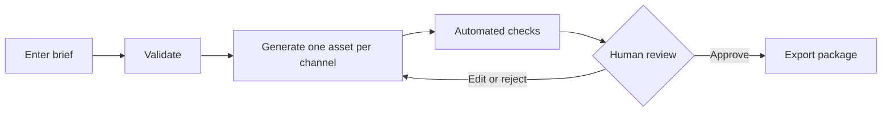

# Vertical Campaign Agent

An AI-assisted workflow for turning campaign briefs into coordinated, trackable marketing assets.

> Independent portfolio project inspired by common B2B marketing workflows. This project is not affiliated with or endorsed by Rundoo.

**Live demo:** https://vertical-campaign-agent.onrender.com (free hosting: the first load may take about a minute)

![Brief form] 
![Asset review with automated checks] 
![Exporting generated results with options] 

## What it does

1. Collects a structured campaign brief (audience, objective, funnel stage, approved facts, CTA).
2. Generates an email, a LinkedIn post, and a digital postcard from the same approved facts, each with A/B variants.
3. Runs automated checks: unsupported statistics, CTA presence, prohibited terms, channel length limits.
4. Puts every asset through a human review workflow (Draft, Needs review, Approved, Rejected).
5. Creates a campaign ID, UTM-tagged links per variant, a measurement plan, and a JSON or Markdown export.

## Workflow



## Design decisions

- **The model writes copy only.** Campaign IDs, UTM links, KPIs, and conversion events are computed by code, so they are deterministic and tested.
- **Grounded generation.** The prompt allows only numbered approved facts, requires `[MISSING: ...]` markers instead of guessing, and requires the model to report which facts it used.
- **One request per asset.** Regenerating one asset never touches the others.
- **Checks report; they never silently rewrite.** Failed checks block approval.
- **Any change resets review.** Editing or regenerating returns an asset to Draft.

## Tech stack

React, TypeScript, Vite, Node, Express, Zod, Vitest, Anthropic API, Render.

## Run it locally

```bash
git clone [your repository address]
cd vertical-campaign-agent
npm install
cp .env.example .env      # Windows: copy .env.example .env
# put your API key in .env
npm run dev
```

Open http://localhost:5173. Run the tests with `npm test`.

## Automated checks

| Check | Result if broken |
|---|---|
| Numbers come from approved information | Fail |
| CTA matches the approved CTA | Fail |
| No prohibited terms or unsupported urgency | Fail |
| Approved fact IDs are real | Fail |
| Length limits by channel | Warning |
| Feature named, variants distinct | Warning |

## Measurement plan logic

Objective and funnel stage map to a primary KPI, secondary KPIs, and a conversion event. No benchmark values are assumed.

## Limitations

- Nothing is published automatically; it is a drafting and review tool.
- Data is stored in the browser only.
- Sample facts are demonstrations, not real product claims.
- Tone is confirmed by a human reviewer.